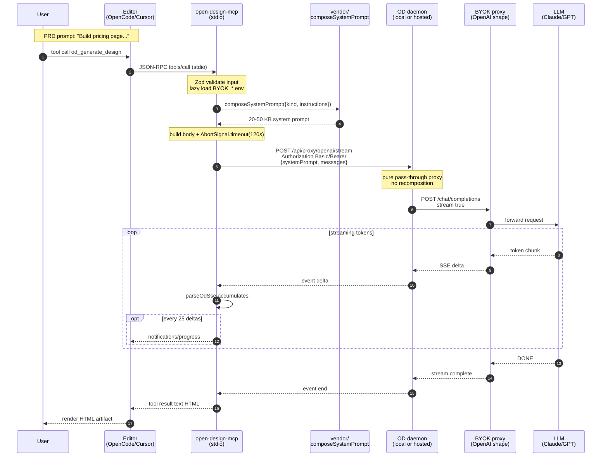

# Architecture: how `od_generate_design` actually works

This doc traces what happens between **"user types a PRD-style prompt in the editor"** and **"HTML design artifact comes back"** for the `od_generate_design` tool. Every claim is backed by a `file:line` citation against `open-design-mcp@0.11.1` (master at the time of writing) or against the upstream [`nexu-io/open-design`](https://github.com/nexu-io/open-design) daemon.

If you want a one-paragraph version, see the "How it works" section in the [README](../../README.md). This doc is the long-form reference.

## TL;DR

**Six hops, mostly client-side.** The MCP server is the brain (composes a ~20–50 KB system prompt locally); the OD daemon is a thin HTTP→SSE pass-through; the LLM does the heavy lifting. End-to-end takes typically **10–60 seconds** depending on prompt complexity.

```
Editor → MCP server → OD daemon → BYOK proxy → LLM → SSE back → text result
```

## Sequence diagram



## Phase 0 — Server startup

The server boots once when the MCP client (editor) spawns it via `npx -y open-design-mcp`.

| Step | File | Lines | Behavior |
|---|---|---|---|
| Load core config eagerly | [`src/config.ts`](../../src/config.ts) | `142–144` (`loadCoreConfig`) | `OD_DAEMON_URL` validated. If missing/invalid → friendly stderr + `process.exit(1)`. |
| Resolve auth descriptor | [`src/config.ts`](../../src/config.ts) | `32–76` (`resolveAuth`) | Infers `none` / `bearer` / `basic` from env, or honors explicit `OD_AUTH_MODE`. Rejects embedded `user:pass@` in URL. |
| Construct `OdClient` | [`src/od-client.ts`](../../src/od-client.ts) | `74–79` | Strips trailing slash; stores `auth` descriptor. |
| Register 8 tools | [`src/tools/index.ts`](../../src/tools/index.ts) | full file | `od_list_projects`, `od_get_project`, `od_create_project`, `od_update_project`, `od_delete_project`, `od_save_artifact`, `od_lint_artifact`, `od_generate_design`. |
| Open stdio transport | [`src/server.ts`](../../src/server.ts) | last block | `StdioServerTransport` handles JSON-RPC over stdin/stdout. |

`BYOK_*` env vars are **not** read at startup — only when `od_generate_design` is invoked. The server runs fine for all other tools with only `OD_DAEMON_URL` set.

## Phase 1 — User invokes the tool

The editor sends a standard MCP `tools/call` request:

```json
{
  "jsonrpc": "2.0",
  "id": 1,
  "method": "tools/call",
  "params": {
    "name": "od_generate_design",
    "arguments": {
      "prompt": "Pricing page for SaaS dev-tool 'Probe' with 3 tiers (Free, Pro $29, Team $99). Pro highlighted. Light theme.",
      "kind": "prototype",
      "userInstructions": "Use Inter font, primary #6366F1",
      "projectInstructions": "Match nano-brain brand"
    }
  }
}
```

Only `prompt` is required. `kind` defaults to `prototype`. The two `*Instructions` fields are optional.

## Phase 2 — Validate + lazy-load BYOK

In [`src/tools/generate-design.ts`](../../src/tools/generate-design.ts):

| Step | Lines | Behavior |
|---|---|---|
| Zod schema | `22–31` | `prompt: z.string().min(1)`, `kind: z.enum([...]).default('prototype')`, optional instructions. MCP SDK validates before the handler runs. Bad input → JSON-RPC `-32602`. |
| Lazy BYOK load | `56–78` | Calls `getByokConfig()` at [`src/config.ts:150–151`](../../src/config.ts), which parses `process.env` against `byokEnvSchema` ([`src/config.ts:18–25`](../../src/config.ts)). If any of `BYOK_BASE_URL`, `BYOK_API_KEY`, `BYOK_MODEL` is missing → catches the `ZodError`, returns `isError: true` with text `"BYOK not configured: missing <field>"`. **Never crashes the server.** |

This lazy pattern means `OpenCode` users can configure the MCP with only `OD_DAEMON_URL` and the 7 non-BYOK tools still work; only `od_generate_design` requires the BYOK credentials.

## Phase 3 — Compose the system prompt locally

This is where the **PRD becomes a Designer's brief**. The handler calls the vendored `composeSystemPrompt` ([`vendor/od-contracts/src/prompts/system.ts:170–324`](../../vendor/od-contracts/src/prompts/system.ts)), which stacks layers in a precise order. What the LLM actually sees is **not** your raw prompt — it's a ~20–50 KB system message containing:

| # | Layer | Size | When included | Source |
|---|---|---|---|---|
| 1 | API-mode override | ~500 B | Always (we always send `streamFormat: 'plain'`) | `system.ts:202–205` |
| 2 | Discovery & philosophy | ~5 KB | Always | `system.ts:213` |
| 3 | Official designer prompt | ~10 KB | Always | `system.ts:215` |
| 4 | Personal memory | ~0.5–5 KB | If `memoryBody` passed (not in v0.11) | `system.ts:225–229` |
| 5 | User instructions | ~0.5–2 KB | If `userInstructions` passed | `system.ts:231–235` |
| 6 | Project instructions | ~0.5–2 KB | If `projectInstructions` passed | `system.ts:237–241` |
| 7 | Design system DESIGN.md | ~5 KB | If `designSystemBody` passed (not in v0.11) | `system.ts:243–247` |
| 8 | Active skill SKILL.md | ~10 KB | If `skillBody` passed (not in v0.11) | `system.ts:249–254` |
| 9 | Plugin block | ~1–5 KB | If `pluginBlock` passed (not in v0.11) | `system.ts:256–258` |
| 10 | Active stage blocks | ~1–3 KB | If `activeStageBlocks` passed (not in v0.11) | `system.ts:260–266` |
| 11 | **Metadata block** | ~2–5 KB | Always — varies by `kind` | `system.ts:268–269` + `359–638` |
| 12 | Deck framework | ~2 KB | Only if `kind: 'deck'` | `system.ts:287–306` |
| 13 | Media contract | ~1 KB | Only if `kind` is `image` / `video` / `audio` | `system.ts:308–317` |
| 14 | Design system override | ~200 B | If design system active | `system.ts:319–321` |

**Important:** layers 4, 7, 8, 9, 10 are vendored but currently inert — `od-generate-design` doesn't pass these inputs yet. The full IDE-mode skill/design-system pipeline lives upstream in the OD web app. We have full API-mode parity. Wiring up skill resolution is a future change (see [Limitations](#known-limitations)).

### What the `kind` knob actually does

For each `kind`, the metadata block at [`system.ts:359–638`](../../vendor/od-contracts/src/prompts/system.ts) injects different rules. Concrete example for `kind: 'prototype'`:

> **screen-file-first rule**: each distinct user-facing screen or surface MUST be delivered as its own HTML file unless the user explicitly asks for a single-page scroll or single-file artifact. Use `index.html` as a launcher/overview that links to screen files when more than one screen exists.

So:
- PRD = "pricing page" → **1 file** (`index.html`)
- PRD = "the whole SaaS — login, pricing, dashboard, settings" → **4–6 files** + `index.html` launcher

Other `kind` values:

| `kind` | Output shape |
|---|---|
| `prototype` | screen-file-first HTML |
| `deck` | presentation with nav/counter/scroll JS + print stylesheet |
| `template` | reusable component HTML |
| `image` / `video` / `audio` | media-generation CLI dispatch |
| `design-system` | DESIGN.md + token files |
| `blog-post` | long-form article HTML |
| `other` | falls back to prototype rules |

## Phase 4 — Build proxy body + compose AbortSignal

In [`generate-design.ts:93–107`](../../src/tools/generate-design.ts):

```typescript
const proxyReq = {
  baseUrl: byok.BYOK_BASE_URL,           // e.g. https://ai-proxy.thnkandgrow.com/v1
  apiKey:  byok.BYOK_API_KEY,            // the proxy's bearer token
  model:   byok.BYOK_MODEL,              // e.g. "open-design" (proxy resolves to claude-sonnet-4-6)
  systemPrompt,                          // ~30 KB string from Phase 3
  messages: [{ role: 'user', content: args.prompt }],
};

// 120s default timeout, OR caller-supplied signal, whichever fires first
const signals = [AbortSignal.timeout(120_000)];
if (extra?.signal) signals.push(extra.signal);
const combined = AbortSignal.any(signals);
```

`DEFAULT_TIMEOUT_MS = 120_000` is defined at [`generate-design.ts:37`](../../src/tools/generate-design.ts). The byok-pipeline-tool design called for 60s (§B6), but real-world generation routinely runs 45–50 s for complex prompts, so we doubled it. Drift documented in `HB-11`.

## Phase 5 — HTTP to the OD daemon

[`src/od-client.ts:154–176`](../../src/od-client.ts) (`proxyStream`):

```
POST  http://ai-open-design:7456/api/proxy/openai/stream
    OR https://od.thnkandgrow.com/api/proxy/openai/stream

Headers:
  content-type: application/json
  accept: text/event-stream
  Authorization: Bearer <OD_API_TOKEN>      ← OD_AUTH_MODE=bearer
              OR Basic <base64(user:pass)>  ← OD_AUTH_MODE=basic
              OR (omitted)                  ← OD_AUTH_MODE=none

Body: JSON.stringify(proxyReq)              // ~30 KB
```

Auth-header logic lives in `OdClient.headers()` at [`src/od-client.ts:158–178`](../../src/od-client.ts) — a 3-way exhaustive switch on the `AuthDescriptor` discriminated union. See [`od-auth-modes` change](../../openspec/changes/archive/2026-05-18-od-auth-modes/design.md) for the design rationale.

If the response is non-2xx, the client reads up to 200 chars of body and throws `OdHttpError` ([`od-client.ts:166–174`](../../src/od-client.ts)). Otherwise it returns the raw `Response` — **body NOT consumed**, so the handler can stream it.

## Phase 6 — Daemon is a pure pass-through proxy

This is the most important non-obvious finding: **the OD daemon does NOT recompose the prompt or inject skills/design-systems.** That all happens client-side in Phase 3. The daemon's job is much smaller.

Upstream handler at [`apps/daemon/src/chat-routes.ts:791–885`](https://github.com/nexu-io/open-design/blob/main/apps/daemon/src/chat-routes.ts):

1. **Validate `baseUrl`** against an SSRF allowlist (lines 806–814)
2. **Prepend the system prompt** as `{role: 'system', content: systemPrompt}` to your `messages` (lines 821–832)
3. **Forward** to `${baseUrl}/chat/completions` with `Authorization: Bearer ${apiKey}` and `stream: true` (lines 837–845)
4. **Transcode** the upstream OpenAI SSE stream into the daemon's own SSE format with `event: start | delta | end | error` (lines 860–879)
5. **Map errors** to retryability signals (401=UNAUTHORIZED, 429=RATE_LIMIT, 5xx=SERVICE_ERROR) (lines 847–858)

**Why the daemon at all?** Three reasons:

- **SSRF protection.** Without it, an MCP client could point `baseUrl` at internal services. The allowlist enforces this.
- **Uniform error mapping.** Every BYOK provider (OpenAI, Anthropic, Azure, Google, Ollama) gets the same retryability signals downstream.
- **Future plugin surface.** The daemon can layer in content policy, token budgeting, audit logging — all without changing MCP clients.

Today it's a thin proxy. Tomorrow it can be smart. Our MCP doesn't care either way.

## Phase 7 — Stream tokens, accumulate, emit progress

Our SSE parser at [`src/sse-parser.ts:96–126`](../../src/sse-parser.ts) is a minimal generator over OD's specific wire format (NOT a generic SSE parser — see [byok-pipeline-tool §B6](../../openspec/changes/archive/2026-05-18-byok-pipeline-tool/design.md)):

| Event | Shape | Handler action |
|---|---|---|
| `event: start` | `{ type: 'start', model?: string }` | Advisory — nothing to do |
| `event: delta` | `{ type: 'delta', delta: string }` | `accumulated += evt.delta`; every 25th delta emit `notifications/progress` (best-effort) |
| `event: end` | `{ type: 'end' }` | Break loop, return accumulated text |
| `event: error` | `{ type: 'error', message: string, code?: string }` | Return `isError: true` with the message |

Buffering logic: the parser splits incoming chunks on `\n\n` (SSE block delimiter), keeps the trailing incomplete block as a "buffer" string, parses complete blocks. Malformed `data:` JSON is silently dropped (logged but doesn't kill the stream).

Progress notifications use the standard MCP notification:

```ts
{
  method: 'notifications/progress',
  params: { progress: deltaCount, progressToken }
}
```

…and they're **best-effort** — a notification failure is caught with `.catch(() => undefined)` and streaming continues ([`generate-design.ts:143–153`](../../src/tools/generate-design.ts)).

## Phase 8 — Result composition + return

The handler returns a standard MCP tool result ([`generate-design.ts:169–171`](../../src/tools/generate-design.ts)):

```json
{
  "jsonrpc": "2.0",
  "id": 1,
  "result": {
    "content": [{ "type": "text", "text": "<!doctype html>\n<html>..." }]
  }
}
```

No `isError` field on success (implicitly `false`). The editor renders the HTML inline (Cursor, Claude Code) or in its chat panel (OpenCode). From there you typically:

1. Save the artifact into the OD project: `od_save_artifact({identifier, title, html})`
2. Lint it: `od_lint_artifact({html})`
3. Iterate: `od_generate_design({prompt: "now make it darker"})` (note: stateless — no conversation memory yet)

## Error mapping table

Every error path eventually flows through [`src/tools/errors.ts:21–45`](../../src/tools/errors.ts) (auth-mode-aware after `#27`):

| Source | HTTP / Cause | Tool result |
|---|---|---|
| OD 401 | wrong creds | `OD auth failed — check <env var per mode>` (auth-mode-aware) |
| OD 403 | SSRF block | `OD rejected request (SSRF protection?)` |
| OD 404 | unknown project | `Project not found: <id>` |
| OD 429 | rate limit | `Rate limited — retry shortly` |
| OD 5xx | daemon error | `OD daemon error: <statusText>` |
| Network / DNS / timeout | `AbortError`, `TypeError` | `OD daemon unreachable: <reason>` |
| SSE `event: error` | upstream LLM error | `<event.message>` |
| Missing BYOK var | `ZodError` | `BYOK not configured: missing <field>` |
| Empty response body | edge case | `OD daemon error: empty response body from proxy/stream` |

Credential values (BYOK key, basic password) never leak through error messages — verified by the sentinel-password test at [`src/__tests__/od-client.test.ts`](../../src/__tests__/od-client.test.ts) and the hosted-OD smoke transcript at [`docs/evidence/od-auth-modes/hosted-smoke-test.md`](../evidence/od-auth-modes/hosted-smoke-test.md).

## Realistic timing breakdown

Measured against `https://od.thnkandgrow.com/` + `ai-proxy.thnkandgrow.com` (claude-sonnet-4-6) on 2026-05-18:

| Phase | Time |
|---|---|
| Phase 1–2: stdio + Zod + env read | < 10 ms |
| Phase 3: composeSystemPrompt | < 50 ms (pure string concat) |
| Phase 4: build body + signals | < 5 ms |
| Phase 5: HTTP to daemon (TCP+TLS) | ~50–300 ms (LAN) / ~200–500 ms (hosted+Cloudflare) |
| Phase 6: daemon → BYOK proxy | ~50–200 ms |
| **Phase 7: LLM generation** | **~5–50 s** ← the bulk |
| Phase 8: SSE finalization + return | < 50 ms |

Simple prompt (`"a pricing page for Probe"`) end-to-end on hosted = **10.5 s**. Multi-screen prototypes hit 30–50 s.

## A realistic PRD-driven workflow

```text
1. You (in editor):
   "Here's my PRD for 'Probe' — a developer tools SaaS.
    [paste 500 lines]
    Build the prototype."

2. Your coding agent (LLM in the editor) reads the PRD, decides scope,
   then invokes the MCP:

   od_generate_design({
     prompt: "Build prototype for Probe SaaS: auth flow, dashboard,
              pricing, settings. Light theme, modern. PRD: [...500 lines...]",
     kind: "prototype",
     userInstructions: "Inter font, primary #6366F1"
   })

3. ~30 seconds later, the MCP returns:

   <html>
     <!-- index.html (launcher) linking to auth/login.html, pricing.html,
          app/dashboard.html, app/settings.html -->
   </html>

4. The coding agent persists each file:
     od_create_project({id: "probe-mvp", name: "Probe MVP"})
     od_save_artifact({identifier: "pricing", title: "...", html: "..."})

5. Optionally lint:
     od_lint_artifact({html: "..."})

6. Iterate (currently stateless — paste old HTML into new prompt):
     od_generate_design({
       prompt: "Make the pricing page darker. Previous HTML: <!doctype html>..."
     })

7. End state: a folder of HTML files representing the prototype, versioned
   in the OD daemon's project store, accessible via od_get_project.
```

## Known limitations

1. **No skill / design-system resolution yet.** Layers 7–10 of the system prompt stack are vendored but inert. The full upstream IDE-mode pipeline (e.g. `audio-jingle` SKILL.md auto-injection) isn't wired. Tracked as a future `skill-resolution` change.
2. **No conversation persistence.** Each `od_generate_design` call is stateless from the conversation perspective; the generated HTML is not written into a project conversation thread automatically. Tracked as the planned `generate-design-persistence` change.
3. **Single-turn only.** No history sent in `messages`. To iterate, the caller must include prior context in the next prompt. Will be solved by the planned `conversation-tools` change.
4. **Synchronous stream collection.** The handler accumulates the entire response before returning. Editors don't see partial HTML — only `notifications/progress` every 25 tokens. Streaming partial content to the editor needs an MCP-spec extension.
5. **Spec drift on timeout.** Design §B6 said 60 s default; we ship 120 s. Documented in `HB-11`. Not corrected because 120 s reflects real usage.

## Related documents

- [`openspec/changes/archive/2026-05-18-byok-pipeline-tool/design.md`](../../openspec/changes/archive/2026-05-18-byok-pipeline-tool/design.md) — original design for §B5 (system prompt composition), §B6 (SSE/timeout/abort), §B8 (error mapping)
- [`openspec/changes/archive/2026-05-18-od-auth-modes/design.md`](../../openspec/changes/archive/2026-05-18-od-auth-modes/design.md) — Basic-Auth threading + the `AuthDescriptor` design
- [`openspec/changes/archive/2026-05-18-fix-401-mode-aware-hint/design.md`](../../openspec/changes/archive/2026-05-18-fix-401-mode-aware-hint/design.md) — mode-aware 401 mapper
- [`openspec/changes/archive/2026-05-18-project-lifecycle-tools/design.md`](../../openspec/changes/archive/2026-05-18-project-lifecycle-tools/design.md) — `od_create_project` / `od_update_project` / `od_delete_project`
- [`docs/evidence/od-auth-modes/hosted-smoke-test.md`](../evidence/od-auth-modes/hosted-smoke-test.md) — end-to-end smoke against `https://od.thnkandgrow.com/`
- Upstream daemon: [`nexu-io/open-design`](https://github.com/nexu-io/open-design) — see `apps/daemon/src/chat-routes.ts:791–885`
